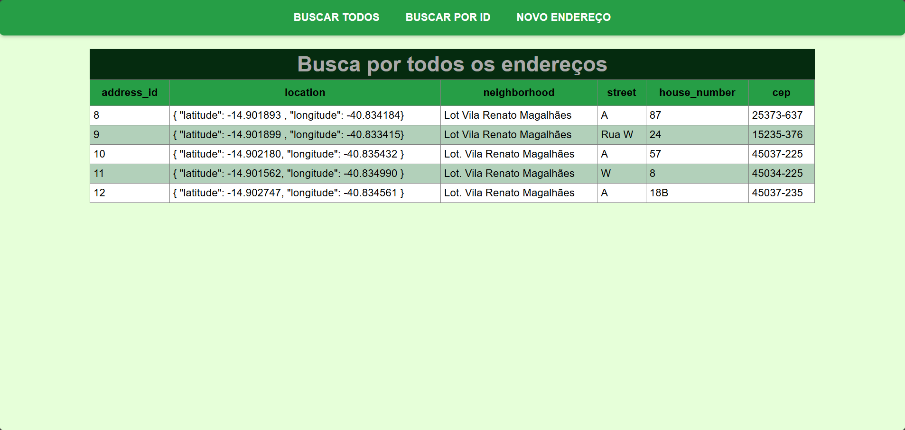
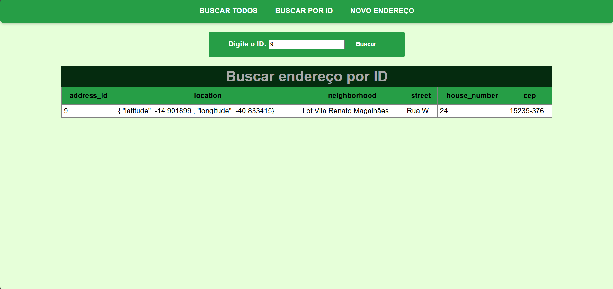
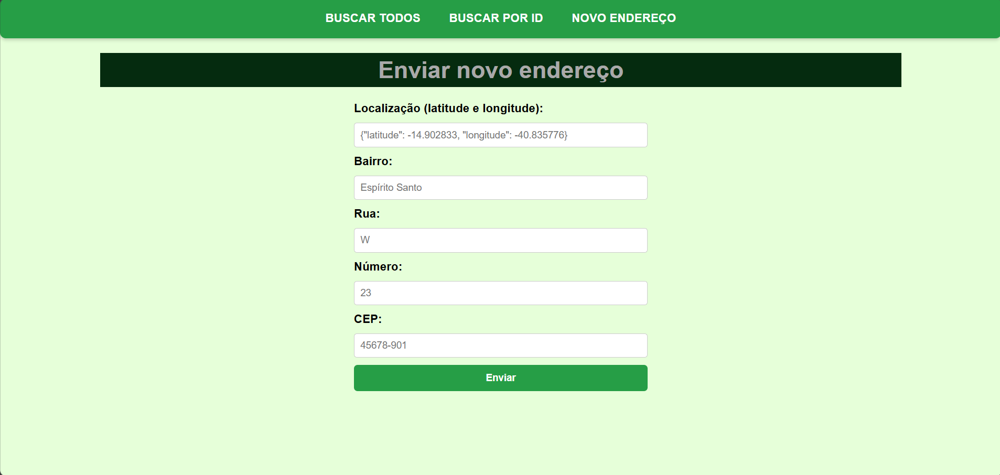
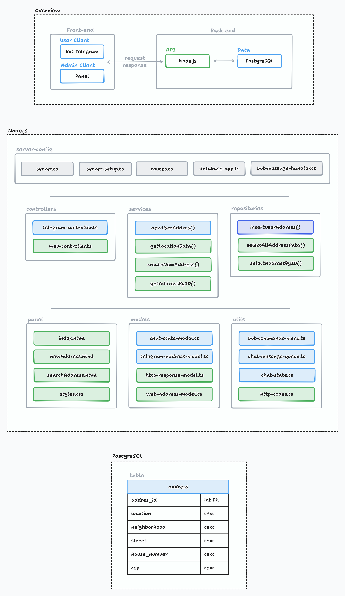

# Telegram Bot Location

## Descrição
Um bot telegram para registrar pedidos de atualização de endereços.

## Funcionalidades gerais
**Front-end:**
- bot Telegram para cadastrar novos endereços
- painel html para exibir endereços cadastrados e cadastrar novos endereços

**Back-end:**
- configuração do bot e captura de mensagens de usuários para cadastro de endereços
- api para salvar os dados no banco de dados PostgreSQL hospedado no Neon

## Início Rápido
**Configurando o .env:**
```
BOT_TOKEN="your-bot-token"
URL="https://your-url.replit.dev/"
DATABASE_URL="neon-postgresql-url"
PORT="3000"
```

**Alterando os links para o seu próprio link replit em:**
- index.html
- newAddress.html
- searchAddress.html

**Iniciando o servidor:**
- clique em `Run`

**Acessando o bot:**
- acesse o seu bot Telegram e envie `/start`

**Acessando o painel HTML**
- https://your-url.replit.dev:3000/

OBS: O bot pode demorar alguns segundos para iniciar depois de um período de inatividade, aguarde. Também verifique se o menu de comandos do bot não está tampando a mensagem inicial do bot.

## Preview
**Bot Telegram:**
<p align="center">
  
  
</p>

**Painel HTML:**
<p align="center">
  
  
  
</p>

## Arquitetura


---

## Como utilizar - DEVs
### Comandos básicos do terminal
- `start:dev` - inicia o servidor utilizando as variáveis definidas em um arquivo .env
- `start:dev:replit` - inicia o servidor utilizando as variáveis do ambiente replit definidas na interface segura (Secret)
- `start:watch` - inicia o servidor no modo watch com as variáveis definidas em uma arquivo .env
- `start:watch:replit` - inicia o servidor no modo watch com as varáveis definidas no ambiente seguro

OBS: Se seu projeto for público, é recomendado utilizar o (Secrets) para armazenar suas informações sensíveis, só utilize arquivos .env em ambientes de desenvolvimento privados.

### Endpoints do painel
- `get /address` - exibe todos os endereços no banco de dados
- `get /address/:id` - busca um endereço específico pelo seu id
- `post /address` - envia os dados de um novo endereço para o servidor

OBS: Os endpoints podem ser utilizados sem a interface do painel, por exemplo, por meio de ferramentas de teste de API como Thunder Client ou diretamente no navegador para requisições GET.

**Formato JSON para enviar dados por um Client API - MÉTODO POST**
```json
{
  "location": "{\"latitude\": -14.902833, \"longitude\": -40.835776}",
  "neighborhood": "Carlos Nobrega",
  "street": "Rua J",
  "house_number": "36",
  "cep": "536363-636"
}
```

### Cuidados para o desenvolvimento no seu próprio ambiente
**Altere os links da aplicação replit em:**
- .env ou na interface de configuração de variáveis ambiente do replit (Secrets)
- index.html
- newAddress.html
- searchAddress.html

OBS: Não esqueça de indicar o número da porta (3000) no link replit nos arquivos html.

**Altere o Token do Bot Telegram em:**
- .env ou na interface de configuração de variáveis ambiente do replit (Secrets)

**Altere o Token para se conectar ao banco de dados PostgreSQL Neon em:**
- .env ou na interface de configuração de variáveis ambiente do replit (Secrets)

**Outros cuidados:**
- o replit utliza portas diferentes para o painel html e para escutar as solicitações do bot, se estiver tendo problemas de execução relacionados com a porta, reinicie a aplicação com `kill 1`
